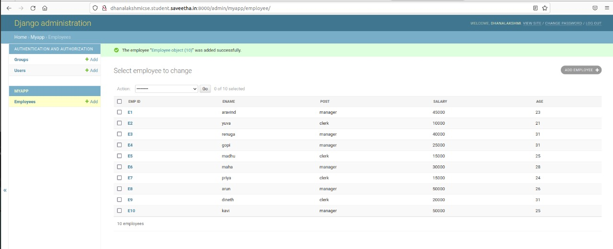
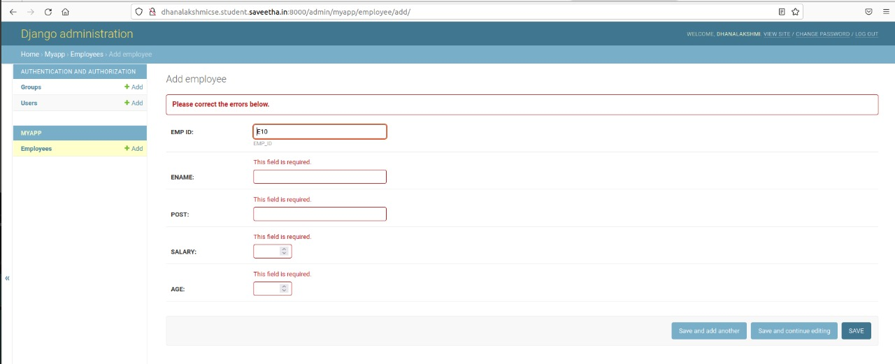

# Django ORM Web Application

## AIM
To develop a Django application to store and retrieve data from a database using Object Relational Mapping(ORM).

## DESIGN STEPS

### STEP 1:
clone the orm repository and lunch django admin

### STEP 2:
startapp and migrate myapp and create employee database with help of models.py and admin.py

### STEP 3:

then runserver and enter atleast 10 employee records into the database

## PROGRAM
```
## Modles code
from django.db import models
from django.contrib import admin
# Create your models here.
class Employee (models.Model):
    EMP_ID=models.CharField(primary_key=True,max_length=20,help_text='ref no')
    ENAME=models.CharField(max_length=100)
    POST=models.CharField(max_length=100)
    SALARY=models.IntegerField()
    AGE=models.IntegerField(null=32)

class EmployeeAdmin(admin.ModelAdmin):
    list_display=('EMP_ID','ENAME','POST','SALARY','AGE')

### Admin code
from django.contrib import admin
from .models import Employee,EmployeeAdmin
admin.site.register(Employee,EmployeeAdmin)
```

## OUTPUT

### Admin page


### primary key confrimation



## RESULT
